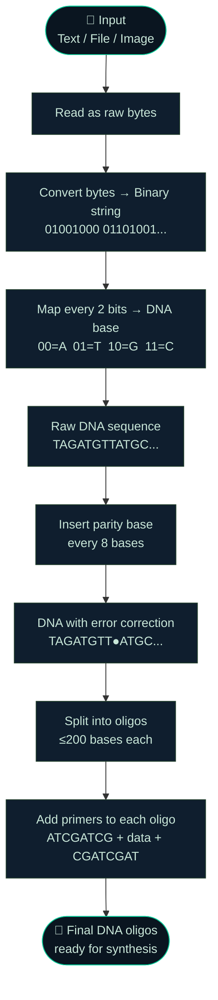
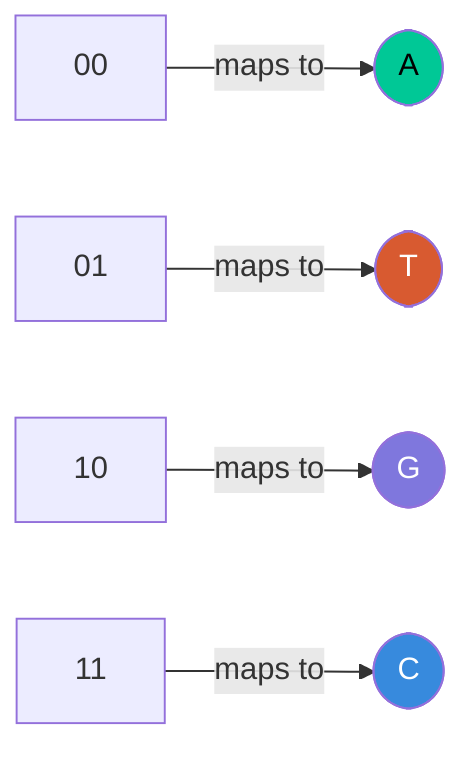
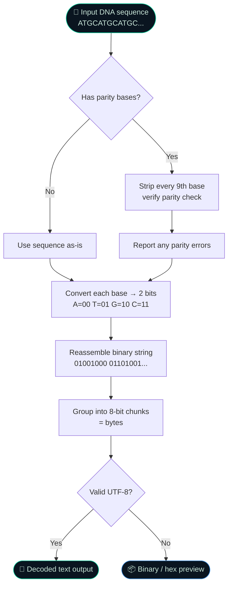
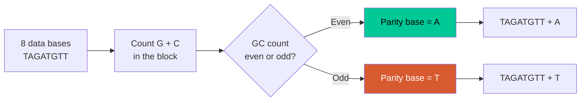
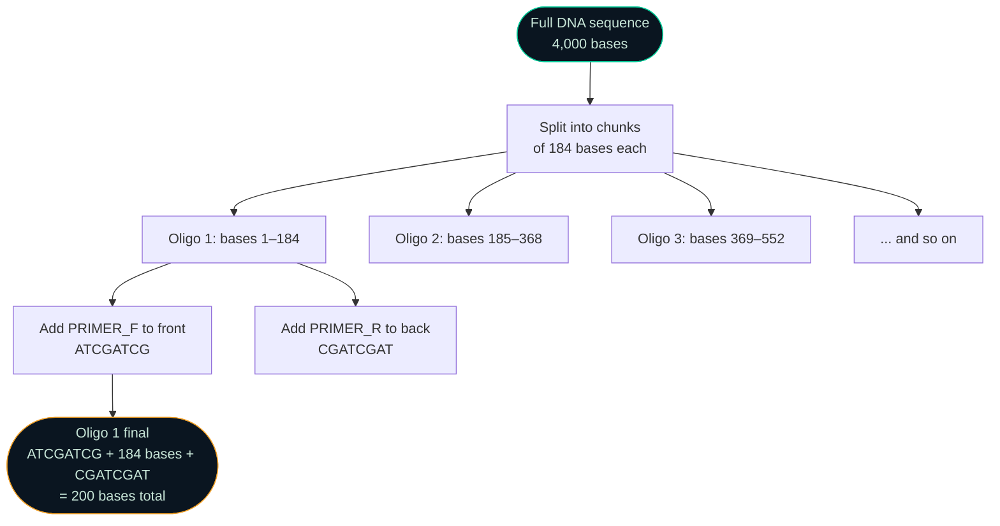
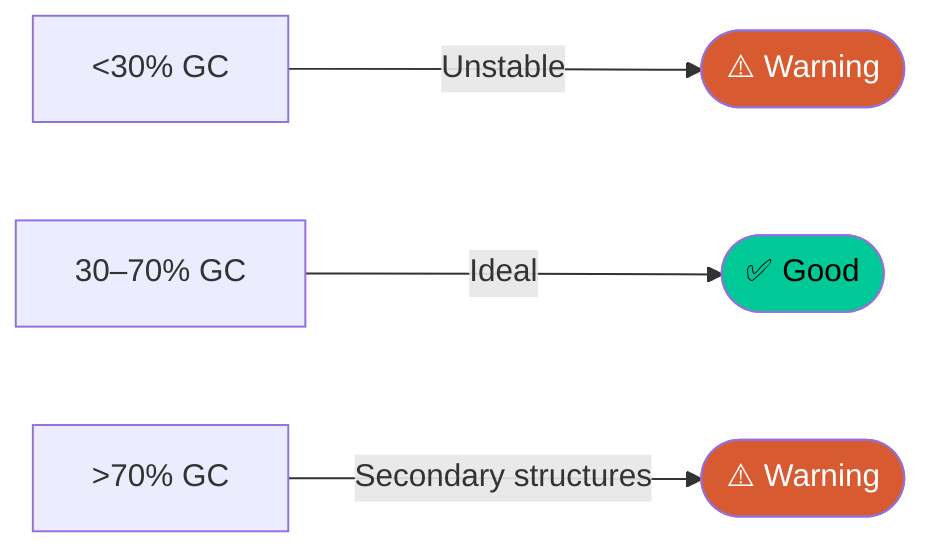

# 🧬 DNA Storage Encoder

> A college project that simulates **storing digital data inside DNA molecules** — converting any file, image, or text into a DNA base sequence (A, T, G, C) with error correction and oligo chunking.

---

## 📌 Table of Contents

- [What is DNA Data Storage?](#what-is-dna-data-storage)
- [Project Structure](#project-structure)
- [How It Works — Full Pipeline](#how-it-works--full-pipeline)
- [Encoding Flow](#encoding-flow)
- [Decoding Flow](#decoding-flow)
- [Error Correction](#error-correction)
- [Oligo Chunking](#oligo-chunking)
- [GC Content](#gc-content)
- [File Breakdown](#file-breakdown)
- [How to Run](#how-to-run)
- [Tech Stack](#tech-stack)
- [References](#references)

---

## 🔬 What is DNA Data Storage?

DNA is nature's original hard drive. Scientists have discovered that the four chemical bases of DNA — **Adenine (A)**, **Thymine (T)**, **Guanine (G)**, and **Cytosine (C)** — can be used to encode binary data the same way a hard drive stores 0s and 1s.

| Property | Hard Drive | DNA Storage |
|---|---|---|
| Storage unit | Bit (0 or 1) | Base (A, T, G, C) |
| Density | ~10 GB/mm³ | ~215 PB/gram |
| Lifespan | 5–10 years | 10,000+ years |
| Access time | Milliseconds | Hours–Days |

This project is a **software simulation** of that process — no actual DNA is synthesised, but all the encoding logic mirrors real-world DNA storage research (Church et al. 2012, Organick et al. 2018).

---

## 📁 Project Structure

```
dna-storage-encoder/
│
├── index.html       ← Page structure (HTML skeleton)
├── style.css        ← All visual styling (dark sci-fi theme)
├── script.js        ← All logic (encoding, decoding, drawing)
└── dna_logic.py     ← Standalone Python version (terminal use)
```

The HTML, CSS, and JS files work together as a browser app. The Python file is an independent terminal tool — both implement the exact same encoding logic.

---

## ⚙️ How It Works — Full Pipeline

This is the complete journey from a file on your computer to a DNA sequence:



---

## 🔐 Encoding Flow

### Step 1 — Bytes to Binary

Every character or byte of your input is converted to its 8-bit binary representation.

```
"Hi"  →  72, 105          (ASCII values)
      →  01001000 01101001  (8-bit binary)
```

### Step 2 — Binary to DNA (2-bit mapping)

The binary string is split into pairs of bits. Each pair maps to one DNA base:



**Example:**
```
Binary:  0 1 0 0 1 0 0 0
Pairs:   01  00  10  00
Bases:    T   A   G   A
```

So `"H"` → `01001000` → `TAGA`

### Step 3 — Full encoded example

```
Input text :  "Hello"
Bytes      :  72  101  108  108  111
Binary     :  01001000 01100101 01101100 01101100 01101111
DNA (raw)  :  TAGATGAT TAGATTAT TAGACCTA TAGACCTA TAGATTTG
              └──────────────────────────────────────────┘
              Each character = 8 bits = 4 DNA bases
```

---

## 🔄 Decoding Flow

Decoding is the full reverse of encoding:



---

## 🛡️ Error Correction

Real DNA synthesis is imperfect — bases can be misread, dropped, or swapped. To detect these errors, this project adds a **parity base** after every 8 data bases (1 byte).

### How parity works



**Example:**
```
Block    :  T A G A T G T T
GC count :  G + G = 2  (even)
Parity   :  A

Full seq :  T A G A T G T T [A] T A G A T T A T [T] ...
                             ↑ parity              ↑ parity
```

When decoding, the same GC count is performed on each 8-base block, and the expected parity base is compared to the actual one. A mismatch = an error in that block.

> **Note:** This is a simple 1-bit parity scheme. Real DNA storage uses Reed-Solomon or fountain codes for stronger multi-error recovery.

---

## 🧪 Oligo Chunking

DNA can only be physically synthesised in short pieces called **oligonucleotides (oligos)**. This project uses a max length of **200 bases per oligo**, matching industry practice.



**Why primers?**

Primers are short known sequences added to both ends of each oligo. In a real lab, they serve as "handles" — PCR machines use them to find and amplify specific oligos from a pool of millions. Here they also act as oligo boundaries for decoding.

```
Each oligo looks like this:
┌──────────┬──────────────────────────────┬──────────┐
│ ATCGATCG │   up to 184 data bases       │ CGATCGAT │
│ PRIMER_F │   (your actual encoded data) │ PRIMER_R │
└──────────┴──────────────────────────────┴──────────┘
   8 bases           184 bases               8 bases
                  ────────────────────────────────────
                              200 bases total
```

---

## 📊 GC Content

GC content is the percentage of bases in a sequence that are G or C. It matters because:

- **Too high (>70%)** — the sequence folds back on itself (secondary structures), making synthesis harder
- **Too low (<30%)** — the sequence is unstable and more prone to errors
- **Ideal range: 40–60%** — stable, easy to synthesise, good for PCR



The app automatically calculates GC% and shows a red warning if the sequence is outside the safe range.

---

## 📂 File Breakdown

### `index.html` — Structure

Contains only HTML — the skeleton of the page. No logic, no colours. Defines:
- The 3 tabs (Text Input, File Upload, Decode DNA)
- The results sections (stats, binary, DNA, GC bar, oligos, canvas)
- Links to `style.css` and `script.js`

### `style.css` — Appearance

All visual styling. Key sections:
- CSS variables (colours, fonts) at the top in `:root {}`
- Dark sci-fi theme with green accents
- Responsive grid for stat cards
- Colour classes `.A` `.T` `.G` `.C` for base colouring

### `script.js` — Logic

All functionality, organised into 9 sections with comments:

| Section | What it does |
|---|---|
| Constants | Mapping tables, primer sequences, oligo limits |
| State variables | Stores current tab, DNA strings |
| Tab switching | Shows/hides the 3 input tabs |
| File upload handlers | Drag-drop, file picker, size formatting |
| Encoding pipeline | `encode()` → `runEncode()` → helpers |
| Decoding pipeline | `decodeDNA()` with parity verification |
| Display helpers | Renders stats, DNA preview, oligos, GC bar |
| Canvas drawing | Draws the double helix using sine waves |
| Utility functions | `formatBytes()`, `formatNumber()`, `copyDNA()` |

### `dna_logic.py` — Python version

Standalone terminal tool with the same logic. Importable as a module:

```python
from dna_logic import encode_text, decode_dna

result = encode_text("Hello World")
print(result.dna_with_parity)     # full DNA sequence
print(result.gc_content_pct)      # GC percentage
print(result.oligos[0].full_sequence)  # first oligo with primers

dec = decode_dna(result.dna_with_parity, has_parity=True)
print(dec.decoded_text)           # "Hello World"
```

---

## 🚀 How to Run

### Browser app (index.html + style.css + script.js)

1. Download all three files into the **same folder**
2. Double-click `index.html`
3. It opens in your browser — no server or installation needed

```
your-folder/
├── index.html   ← open this
├── style.css
└── script.js
```

### Python terminal tool (dna_logic.py)

Requires Python 3.9+ — no pip installs needed.

```bash
# Run demo (encodes a sample sentence, then decodes it back)
python dna_logic.py

# Encode text
python dna_logic.py encode-text "Hello World"

# Encode any file
python dna_logic.py encode-file photo.jpg

# Decode a DNA string
python dna_logic.py decode ATGCATGCATGC...

# Roundtrip test (encode → decode → verify match)
python dna_logic.py roundtrip "test message"
```

---

## 🛠️ Tech Stack

| Layer | Technology |
|---|---|
| Frontend structure | HTML5 |
| Styling | CSS3 (custom properties, grid, canvas) |
| Logic | Vanilla JavaScript (no frameworks) |
| Python tool | Python 3.9+ standard library only |
| Fonts | Google Fonts — Orbitron, Share Tech Mono |
| Diagrams (this README) | Mermaid.js (rendered by GitHub) |

---

## 📚 References

- Church, G. M., Gao, Y., & Kosuri, S. (2012). [Next-generation digital information storage in DNA](https://www.science.org/doi/10.1126/science.1226355). *Science*, 337(6102), 1628.
- Organick, L. et al. (2018). [Random access in large-scale DNA data storage](https://www.nature.com/articles/nbt.4079). *Nature Biotechnology*, 36, 242–248.
- Ceze, L., Nivala, J., & Strauss, K. (2019). [Molecular digital data storage using DNA](https://www.nature.com/articles/s41576-019-0125-3). *Nature Reviews Genetics*, 20, 456–466.

---

## 👨‍💻 Author

Built as a college project to simulate DNA-based digital data storage in software.

---

*"DNA is the oldest storage medium on Earth — and potentially the most efficient one we'll ever find."*
